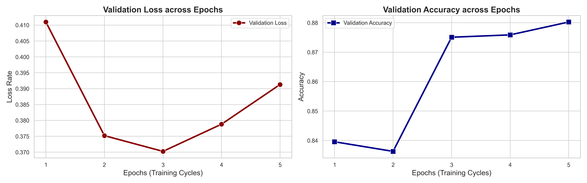
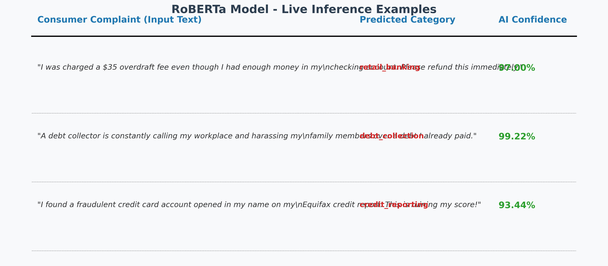

# 🏦 Financial Complaint NLP Classifier

Welcome to my NLP project! I'm **Mostafa**, and I built this end-to-end pipeline to classify raw consumer financial complaints into their respective categories using Artificial Intelligence.

When dealing with financial complaints, the text is often messy, unstructured, and highly imbalanced. I wanted to build a system that can accurately read a complaint and route it to the correct department automatically. To achieve this, I fine-tuned the powerful **RoBERTa-base** transformer model.

## 🌟 What I Built
- **Optimized Training (`01.Training_Kaggle.ipynb`):** A custom training loop I wrote using PyTorch. I utilized Mixed Precision (FP16) to speed up training on dual GPUs, and implemented dynamic class weighting to ensure the model doesn't ignore rare complaints.
- **Analytics & Visualization (`02_Training_Visualization.ipynb`):** I created this to visually track how the model learned over time, displaying side-by-side Epoch metrics and dataset distribution.
- **Inference Engine (`03_Model_Inference.ipynb`):** A clean testing environment where anyone can type a new complaint and see the model predict the category in real-time.

## 📈 Model Performance
To ensure the model is highly accurate, I tracked its performance across multiple training cycles. The graphs below (generated directly from my training logs) show how the model's accuracy increased while its error rate decreased. 

Ultimately, the model achieved an impressive **~88% Validation Accuracy** on complex, imbalanced financial data!

  

## 🧠 Live AI Inference Examples
To prove the model's capabilities, I ran live inference on completely new, unseen financial complaints. The model accurately identified the category of the complaint with extremely high confidence.

  

\n## 🚀 How to Run My Code
You can run this project locally right away:
1. Install the requirements: `pip install -r requirements.txt`
2. Open Jupyter Notebook: `jupyter notebook`
3. Dive into the notebooks!

## 📄 License
This project is open-sourced under the **MIT License**. Feel free to use, modify, and learn from the code!

---
*Developed with passion by Mostafa Abdallah.*
